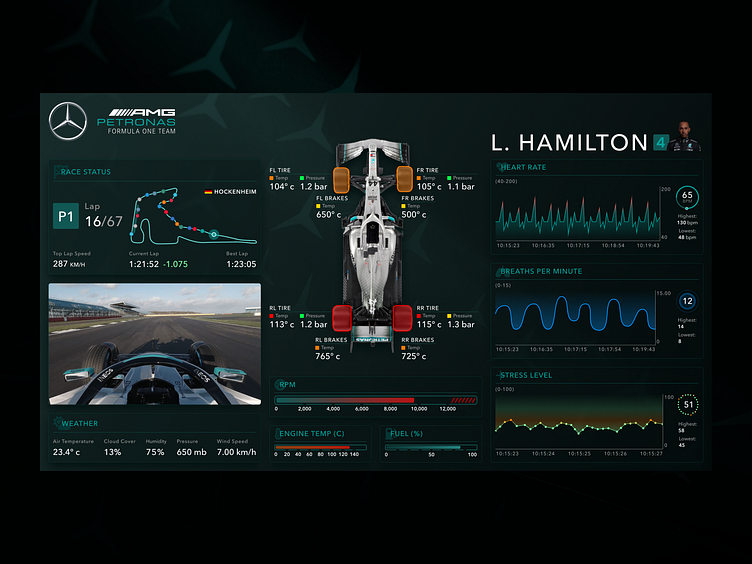

# NATS - Neuro-Adaptive Telemetry System 🏎️🧠

[](https://YOUR_USERNAME.github.io/neuro-adaptive-telemetry-dashboards)
[](LICENSE)

> Real-time multi-modal biosignal telemetry dashboard for Formula EV driver safety AI with BP16 compliance



---

## ✨ Features

- **🧠 10+ Biosignal Modalities** - ECG, EEG, EMG, GSR, PPG, Eye Tracking, Respiration, Temperature, EOG, Motion
- **🤖 AI Emotional State Prediction** - Real-time stress, focus, fatigue, and alertness analysis
- **🏎️ Vehicle Telemetry** - Motor, battery, brakes, tires with 3D visualization
- **⚡ Formula E Integration** - Attack Mode, Power Maps, Regenerative Braking
- **🔒 BP16 Safety Compliance** - Industry-standard driver monitoring thresholds
- **🌡️ Thermal Management** - Coolant system monitoring and control
- **☁️ Weather Integration** - Real-time track conditions

---

## 🚀 Quick Start

### Prerequisites
- Node.js 20+
- Python 3.11+
- Docker (optional)

### Local Development

```bash
# Frontend
cd frontend
npm install --legacy-peer-deps
npm run dev

# Backend (new terminal)
cd backend
pip install -r requirements.txt
python main.py
```

Open [http://localhost:5173](http://localhost:5173)

### Docker

```bash
docker compose up -d --build
```

- Frontend: [http://localhost:80](http://localhost:80)
- Backend API: [http://localhost:8001](http://localhost:8001)

---

## 📁 Project Structure

```
├── frontend/           # Vite + React + Three.js dashboard
│   ├── src/
│   │   ├── components/ # React components
│   │   └── App.tsx     # Main application
│   └── Dockerfile
│
├── backend/            # Python FastAPI server
│   ├── main.py         # API endpoints & WebSocket
│   ├── biosignals.py   # Multi-modal signal simulation
│   ├── vehicle_telemetry.py
│   └── Dockerfile
│
├── docker-compose.yml  # Container orchestration
└── .github/workflows/  # CI/CD pipelines
```

---

## 🌐 Deployment

### GitHub Pages (Frontend Only)

Automatically deploys on push to `master` via GitHub Actions.

> ⚠️ **Note**: GitHub Pages hosts static files only. Backend requires a separate hosting solution (Render, Railway, etc.)

1. Enable GitHub Pages in repository Settings → Pages → Source: **GitHub Actions**
2. Push to `master` branch
3. Access at: `https://YOUR_USERNAME.github.io/neuro-adaptive-telemetry-dashboards`

### Full Stack (Docker)

```bash
docker compose up -d
```

See [DEPLOYMENT_GUIDE.md](DEPLOYMENT_GUIDE.md) for detailed instructions.

---

## 🔌 API Endpoints

| Endpoint | Description |
|----------|-------------|
| `GET /health` | Health check |
| `GET /api/telemetry` | Full telemetry snapshot |
| `GET /api/biosignals` | Raw biosignal data |
| `GET /api/vehicle` | Vehicle telemetry |
| `GET /api/safety` | AI safety prediction |
| `WS /ws` | Real-time telemetry stream |
| `WS /ws/vehicle` | 60Hz vehicle telemetry |

---

## 🛠️ Tech Stack

| Layer | Technology |
|-------|------------|
| Frontend | React 18, Three.js, Framer Motion, Vite |
| Backend | Python, FastAPI, WebSockets, Uvicorn |
| Visualization | React Three Fiber, Drei |
| Containerization | Docker, Docker Compose |
| CI/CD | GitHub Actions |

---

## 📄 License

MIT © Black Pearl Racing Team

---

<p align="center">
  
</p>
